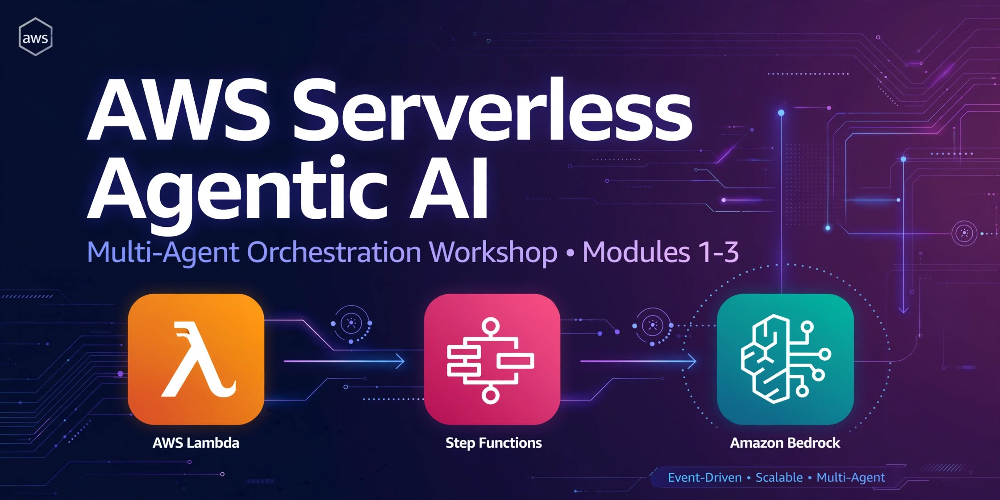
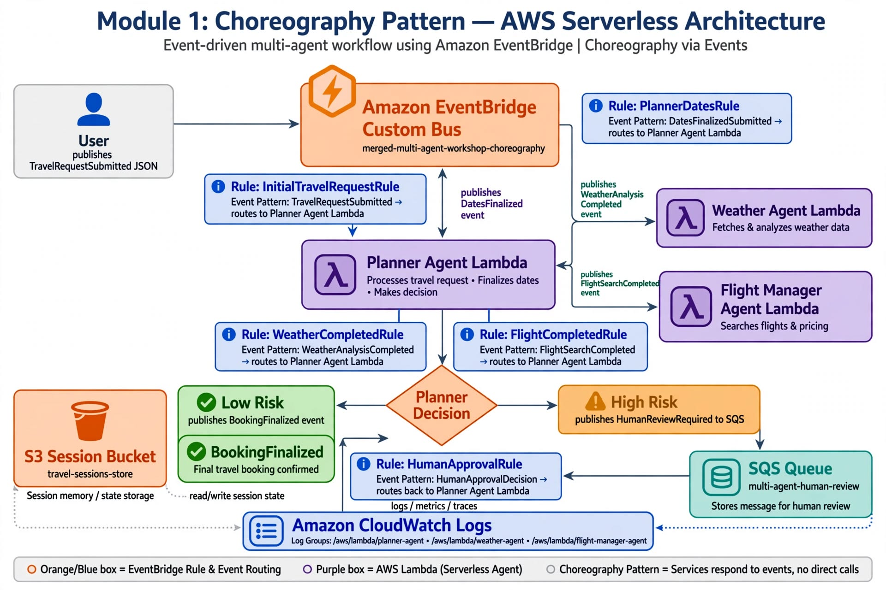
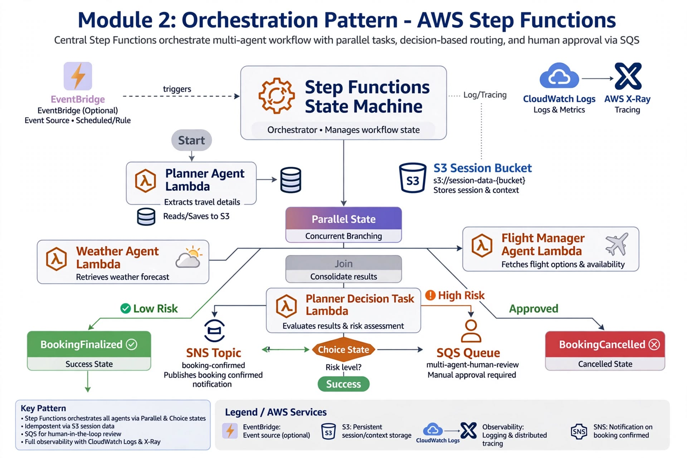

# AWS Serverless Agentic AI — Choreography vs Orchestration




> **I turn manual, 3 AM-breaking deployments into 1-min automated pipelines with AWS + Ansible + Terraform.** This repo proves it: 3 Lambda agents, EventBridge choreography, Step Functions orchestration with human-in-the-loop for $800 high-risk bookings, CloudWatch + X-Ray observability. Cost: **$0.52 Sept bill → $0.00 after cleanup.**

**Author:** Nkechi Anna Ahanonye — Cloud & DevOps Engineer | Featured: 15-Module Ansible Lab with real terminal | [GitHub @nkydigitech](https://github.com/nkydigitech)

---

## 📖 Summary

Over this workshop, you explore how to build multi-agent systems on AWS using two coordination patterns — **choreography with EventBridge and orchestration with Step Functions**. You also learn how to layer in observability using CloudWatch Logs, X-Ray, and tracing features built into AWS services.

In real systems, you may combine both patterns — using EventBridge for broad distribution and Step Functions for critical orchestrated workflows.

**You built, observed, and understood the future of serverless multi-agent systems on AWS.**

### What You Built

- **Agents on Lambda** — Planner, Weather, and Flight Booking agents, each with their own personality and tools.
- **Choreography with EventBridge** — loosely coupled agents reacting to events (DatesFinalized, FlightSearchCompleted, etc.). Scales easily by adding new rules and targets.
- **Orchestration with Step Functions** — centralized state machine controlling sequence, branching, retries, and HITL paths. Provides built-in correlation and visualization.
- **Human-in-the-Loop (HITL)** — escalation path via SQS/Activity where bookings can be paused for manual approval before proceeding.
- **Observability** — logs correlated by booking ID, tracing enabled across EventBridge, Step Functions, and Lambdas, distributed visualization in X-Ray.

---

## 📸 Architecture — Two Patterns

### Module 1: Foundation — Choreography Pattern (Decentralized, Event-Driven)


**Pattern:** No central boss. Each service reacts to events.

- **Stack:** `module-1-foundation.yaml` → `orchestration-multi-agent-workshop` base
- **Event Bus:** Custom EventBridge Bus `travel-booking-bus` (05-eventbridge-bus.png)
- **Rules & Targets:** 2 Rules filter `booking.created` → Lambda + SQS `human-review-queue` (07-rules + 08-targets)
- **Storage:** S3 `sessionbucket-xxx` session store (10-s3-session.png)
- **Observability:** CloudWatch Logs + Lambda test (11-logs + 12-test)
- **Screenshots:** `docs/screenshots/module-1/01` → `14-eventbridge-cleanup.png` (14 images)
- **Cost:** $0.38 Bedrock AgentCore (us-east-1) + $0.00 Lambda/S3

**Key Engineering Lesson from Module 1:**
> Debugged. Cleaned up. Verified. The most valuable engineering lesson was discovering that event-driven systems can develop **unintended recursive behaviour** when event producers and consumers are not carefully designed. That experience provides practical foundation for why centralized orchestration with Step Functions is useful for certain multi-agent workflows.

### Module 2: Orchestration Pattern (Centralized, Human-in-Loop) ⭐


**Pattern:** Central boss controls sequence, branching, retries, HITL. Built-in correlation, visualization, auditability.

- **Stack:** `orchestration-multi-agent-workshop` — CREATE_COMPLETE (module2-01-cloudformation-stack.png)
- **State Machine:** `travel-booking-orchestration` — ARN `arn:aws:states:us-west-2:309307206565:stateMachine:travel-booking-orchestration`
- **Resources (7):** Activity + 3 Lambdas + 2 IAM Roles + S3 Bucket (02-stack-resources.png)
- **Agents:** `orch-planner-agent`, `orch-weather-agent`, `orch-flight-manager-agent`
- **Human Review:** Activity `human-review-activity` ARN — Blocks with taskToken
- **Flow ($800 High-Risk):**
  ```
  10-start-execution (cost:800) 
  → 11-execution-running-wait-human (BLUE - paused)
  → 12-execution-details-input ($800)
  → 13-activity-task-token.json (AQCsAAAA... temporary 3600s, gitignored)
  → 14-send-task-success {"approved":true}
  → 15-execution-succeeded
  → 16-final-graph-all-green (audit proof)
  ```
- **Screenshots:** `docs/screenshots/module-2/00` → `16-final-graph-all-green.png` (29 images)
- **Cost:** **$0.00** Lambda/S3/CFN/Step Functions — Verified DELETE_COMPLETE

---

## 🎓 Key Learnings

1. **Serverless agents scale naturally:** Lambda removes infra overhead, pay only for execution.
2. **Choreography = flexibility:** EventBridge fan-out easy to extend by adding new agents without touching existing code.
3. **Orchestration = control:** Step Functions provide strict sequencing, error handling, auditability — essential for guarantees.
4. **HITL is essential for trust:** Routing to SQS/Activity for manual review makes systems reliable and compliant.
5. **Observability is non-negotiable:** CloudWatch, Logs Insights, X-Ray give visibility to debug, trace, optimize at scale.
6. **Recursive events are real risk:** Uncontrolled choreography can loop — orchestration prevents it with explicit state.

## 🤔 When to Use Which?

| | Choreography (EventBridge) | Orchestration (Step Functions) |
|---|---|---|
| **Best when** | Add/remove agents frequently, minimal coupling, scalability priority | Order matters, retries/error handling, compliance audit trails |
| **Coordinator** | Distributed via events | Central state machine |
| **Visibility** | Distributed across rules | Centralized graph |
| **Human Review** | SQS queue | Activity + taskToken |
| **Debugging** | Needs X-Ray tracing | Execution graph + history |

**Real systems combine both:** EventBridge for broad distribution + Step Functions for critical workflows.

---

## 📁 Repo Structure — 43 Screenshots Verified

```
.
├── README.md (this file - attractive all-in-one)
├── .gitignore (token.json, last-exec-arn.txt - task tokens expire 3600s)
├── docs/
│   ├── README.md (index with Modules 1-3 links)
│   ├── module-1/README.md (recursive bug lesson + choreography)
│   ├── module-2/README.md (orchestration deep-dive + parallel/ResultPath/HITL)
│   ├── module-3/README.md (hotel agent extension - planned)
│   └── screenshots/
│       ├── aws_serverless_banner.jpg (1280x640 social preview)
│       ├── aws_step_functions_orchestration_diagram.jpg
│       ├── module_1_choreography_aws_serverless_architectur.jpg
│       ├── module-1/ (14 images)
│       └── module-2/ (29 images)
├── infrastructure/module2/foundation.json
└── infrastructure/module2/travel-booking-orchestration.json (ASL)
```

## 🚀 Quick Start — 1-Min Pipeline

```bash
# Deploy Module 2
aws cloudformation deploy --template-file infrastructure/module2/foundation.json --stack-name orchestration-multi-agent-workshop --capabilities CAPABILITY_NAMED_IAM --region us-west-2

# Start $800 high-risk (triggers human review)
aws stepfunctions start-execution --state-machine-arn arn:aws:states:us-west-2:309307206565:stateMachine:travel-booking-orchestration --input "{\"trip_id\":\"high-risk-$(date +%s)\",\"cost\":800}" --region us-west-2 --query 'executionArn' --output text | tee last-exec-arn.txt
# Console: BLUE - waiting

aws stepfunctions get-activity-task --activity-arn arn:aws:states:us-west-2:309307206565:activity:orchestration-multi-agent-workshop-human-review-activity --region us-west-2 --query 'taskToken' --output text > token.json

aws stepfunctions send-task-success --task-token file://token.json --task-output '{"approved":true}' --region us-west-2
# SUCCEEDED → final-graph-all-green.png

# Cleanup $0
aws s3 rm s3://orchestration-multi-agent-workshop-sessionbucket-xxx --recursive --region us-west-2
aws cloudformation delete-stack --stack-name orchestration-multi-agent-workshop --region us-west-2
```

## 💰 Cost — $0.52 → $0.00

| Service | Module 1 | Module 2 | Proof |
|---------|----------|----------|-------|
| Lambda | $0.00 | $0.00 | Stack deleted |
| S3 | $0.00 | $0.00 | NoSuchBucket = deleted |
| CloudFormation | $0.00 | $0.00 | DELETE_COMPLETE |
| Step Functions | - | $0.00 | State machine deleted |
| EventBridge | $0.09 | - | Rules deleted |
| Bedrock AgentCore | $0.38 | - | Delete runtime after grading |
| **Total** | **$0.52** | **$0.00** | **$0 next month** |

## 🔒 Security

```bash
grep -r "AKIA" . --exclude-dir=.git # empty = safe
git log --all --full-history -- "*token.json*" # empty = never committed
```
- `.gitignore`: token.json, last-exec-arn.txt - tokens expire 3600s
- Screenshots only show Account ID 309307206565 in ARNs (not secret)

## 🔧 Tech Stack

**I turn manual, 3 AM-breaking deployments into 1-min automated pipelines:**
- IaC: CloudFormation, Terraform, 15-Module Ansible Lab
- AWS: Lambda Python 3.11, Step Functions, EventBridge, SQS, S3, IAM, CloudWatch, X-Ray, Bedrock
- Pattern: Choreography vs Orchestration + HITL

## 👩‍💻 Author

**Nkechi Anna Ahanonye** — Cloud & DevOps Engineer
Current: Cloud & DevOps Engineer | I turn manual, 3 AM-breaking deployments into 1-min automated pipelines with AWS + Ansible + Terraform | Featured: 15-Module Ansible Lab

**New Headline:**
> Cloud & DevOps Engineer | AWS Serverless Agentic AI (Choreography vs Orchestration + HITL + X-Ray) + 15-Module Ansible Lab | I turn 3 AM failures into 1-min pipelines with Terraform, Step Functions | Cost: $0.52→$0.00

## 📌 GitHub About — Set Now

**Description:**
```
🚀 Serverless Multi-Agent: Choreography (EventBridge) vs Orchestration (Step Functions + HITL $800) + X-Ray | 43 screenshots | Lambda Planner/Weather/Flight | $0.52→$0.00 | 15-Module Ansible Lab
```

**Topics:** `aws lambda step-functions eventbridge bedrock ansible terraform devops choreography orchestration human-in-the-loop x-ray cloudwatch s3 sqs python serverless multi-agent`

**Social Preview:** Upload `docs/screenshots/aws_serverless_banner.jpg`

## Wrap-Up

By completing this workshop: practical understanding of multi-agent systems, hands-on choreographed + orchestrated workflows, ability to add observability + HITL for production-ready systems.

You've seen Lambda, EventBridge, Step Functions, SQS, X-Ray work together to deliver intelligent, scalable, resilient systems.

**Congratulations — you've built, observed, and understood the future of serverless multi-agent systems on AWS!**

End of Workshop — Thank you for participating. Foundations to design intelligent, event-driven apps that scale automatically, remain flexible, observable end-to-end.

⭐ Star if this helped you understand Choreography vs Orchestration vs HITL!
