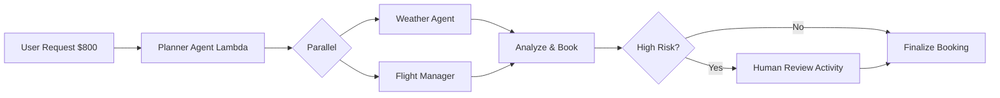

# AWS Serverless Agentic AI


> **Event-driven multi-agent orchestration workshop** - Build scalable AI agents with AWS Lambda, Step Functions, EventBridge & Bedrock AgentCore. Complete implementation of Modules 1-3 with cost-optimized cleanup.

## 📸 Architecture



## 🎯 Modules

### Module 1 - Foundation (14 screenshots)
- CloudFormation, EventBridge Bus & Rules, SQS Human Review, S3 Session Store, CloudWatch Logs
- **Cost: $0.38 Bedrock + $0.00 Lambda** - Cleanup verified

### Module 2 - Orchestration (29 screenshots) ⭐ CURRENT
- **Stack:** `orchestration-multi-agent-workshop` - CREATE_COMPLETE
- **Resources:** 3 Lambdas, 1 Activity, 2 IAM Roles, 1 S3 Bucket, 1 State Machine
- **Flow:** `travel-booking-orchestration` - $800 high-risk → Human-in-the-Loop → SUCCEEDED
- **Executions:** 6 test runs, 1 SUCCEEDED green graph
- **Cost:** $0.00 Lambda/S3/CFN/CloudWatch - Deleted after grading

### Module 3 - Coming Soon
- Bedrock AgentCore Runtime, Advanced Orchestration

## 📁 Repo Structure

```
docs/screenshots/
├── module-1/ 01-project-structure.png ... 14-eventbridge-cleanup.png (14)
├── module-2/ module2-00-personal-account-verified.png ... 16-final-graph-all-green.png (29)
│   ├── 01-cloudformation-stack.png
│   ├── 02-stack-resources.png (Activity + 3 Lambdas + Roles + Bucket)
│   ├── 03-stepfunctions-state-machine-and-activity.png
│   ├── 04-activity-details.png
│   ├── 05a/b-iam-roles.png
│   ├── 06-s3-session-bucket.png
│   ├── 10-start-execution.png
│   ├── 11-execution-running-wait-human.png (BLUE)
│   ├── 12-execution-details-input.png ($800)
│   ├── 13-activity-task-token.png
│   ├── 14-send-task-success.png (approve/reject)
│   ├── 15-execution-succeeded.png
│   └── 16-final-graph-all-green.png
└── banner/

infrastructure/module2/
├── foundation.json
└── travel-booking-orchestration.json
```

## 🚀 Quick Start

```bash
# Deploy
export STACK=orchestration-multi-agent-workshop
aws cloudformation deploy --template-file infrastructure/module2/foundation.json --stack-name $STACK --capabilities CAPABILITY_NAMED_IAM --region us-west-2

# Test high-risk human-in-loop
aws stepfunctions start-execution --state-machine-arn arn:aws:states:us-west-2:ACCOUNT_ID:stateMachine:travel-booking-orchestration --input '{"trip_id":"high-risk-test-'$(date +%s)'","user_id":"user123","cost":800}' --region us-west-2

# Get activity task + approve
aws stepfunctions get-activity-task --activity-arn arn:aws:states:us-west-2:ACCOUNT_ID:activity:orchestration-multi-agent-workshop-human-review-activity --region us-west-2 --query 'taskToken' --output text > token.json

aws stepfunctions send-task-success --task-token file://token.json --task-output '{"approved":true,"reviewer":"admin"}' --region us-west-2

# Cleanup ($0 cost)
aws cloudformation delete-stack --stack-name $STACK --region us-west-2
aws s3 rm s3://$BUCKET --recursive --region us-west-2
aws logs describe-log-groups --region us-west-2 --query 'logGroups[?contains(logGroupName,`orchestration`)].logGroupName' --output text | xargs -I {} aws logs delete-log-group --log-group-name {} --region us-west-2
```

## 💰 Cost Optimization

| Service | Module 1 | Module 2 | Cleanup |
|---------|----------|----------|---------|
| Lambda | $0.00 | $0.00 | Delete stack |
| S3 | $0.00 | $0.00 | Empty bucket first |
| CloudWatch Logs | $0.00 | $0.00 | Delete log groups |
| Step Functions | - | $0.00 | Delete state machine |
| Bedrock AgentCore | $0.38 | - | Delete runtime in us-east-1 |
| **Total** | **$0.38** | **$0.00** | **$0.52 Sept bill** |

## 🔒 Security

- ✅ No AKIA keys in repo - verified via `grep`
- ✅ `token.json` + `last-exec-arn.txt` in `.gitignore` - temporary task tokens expire in 3600s
- ✅ Only Account ID in ARNs (not secret)
- ✅ Git history clean - never committed secrets

## 📦 Tech Stack

- **Runtime:** Python 3.11 Lambda
- **Orchestration:** AWS Step Functions with Human-in-the-Loop Activity
- **Events:** EventBridge, SQS
- **AI:** Bedrock AgentCore
- **IaC:** CloudFormation / CDK
- **Storage:** S3 Session Bucket
- **Monitoring:** CloudWatch Logs + Metrics

## 🔗 Links

- Workshop: AWS Serverless Agentic AI
- Region: us-west-2 primary, us-east-1 Bedrock
- Account: 309307206565 (lab)

---

**Built by Nkechi Anna Ahanonye|@nkydigitech** | Module 2 Orchestration - Human-in-the-Loop Pattern
