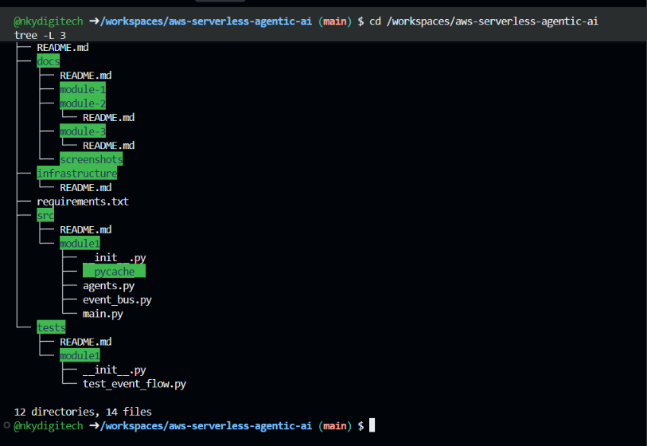

# Module 1: Event-Driven Multi-Agent Architecture

## Overview

This module implements a serverless multi-agent architecture using Amazon EventBridge for event-driven communication between agents.

## Architecture

Planner Agent → Weather Agent → Flight Manager Agent → Planner Agent

Amazon EventBridge routes events between the agents.

## Agents

### Planner Agent

Tools:
- `extract_travel_details`
- `analyze_and_decide`
- `finalize_booking`

### Weather Agent

Tools:
- `get_weather_forecast`
- `analyze_travel_risk`
- `generate_recommendations`

### Flight Manager Agent

Tools:
- `search_flights`
- `evaluate_options`
- `check_availability`

## Event Flow

1. `TravelRequestSubmitted`
2. `DatesFinalized`
3. `WeatherAnalysisCompleted`
4. `FlightSearchCompleted`
5. Planner evaluates the results
6. `BookingFinalized` or `HumanReviewRequired`

## EventBridge Rules

- `InitialTravelRequestRule`
- `PlannerDatesRule`
- `WeatherCompletedRule`
- `FlightCompletedRule`

## Human-in-the-Loop

High-risk or review-required bookings are routed to the `multi-agent-human-review` SQS queue.

Human approval is returned through the `HumanApprovalDecision` event.

## Monitoring

Amazon CloudWatch Logs is used to monitor the event flow and agent activity.

## Testing

Testing and screenshots will be added after the AWS resources are deployed and verified.

## Evidence

### Project Structure

## Deployment Status

Pending AWS deployment.

## Cleanup

AWS resources will be removed after testing to avoid unnecessary ongoing usage.
